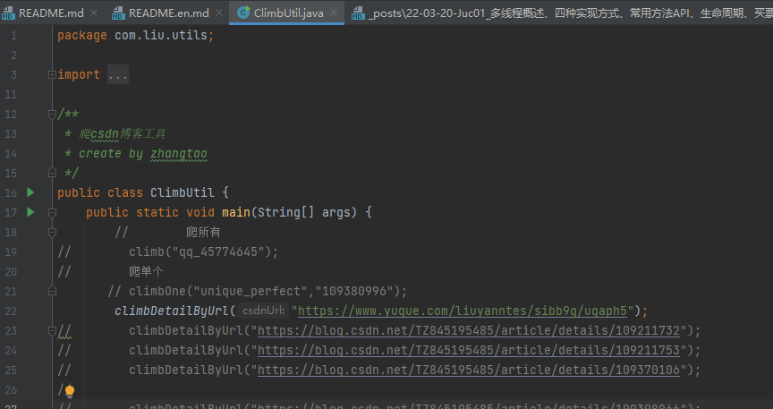

# climbCSDNblogsUtils
## 将CSDN文章转化为Markdown文档
`原理`:
- 使用jsoup解析csdn文档

`使用`:
- 直接将CSDN文章的url放入`climbDetailByUrl(url)`方法的参数即可
- 也支持爬取某个作者所有的文章,`climb(userName)`

## 例如：
### 获取单个文章markdown

右键运行即可 存到_posts文件夹
```java
public class ClimbUtil {
    public static void main(String[] args) {
        climbDetailByUrl("https://blog.csdn.net/qq_45774645/article/details/123489756?spm=1001.2014.3001.5502");
    }
}
```
### 获取所有的文章markdown
```java
public class limbUtil {
    public static void main(String[] args) {
        climb(userName);
    }
}
```
> 其中userName指定是博客介绍中的名字
# csdn_article-to-markdown
